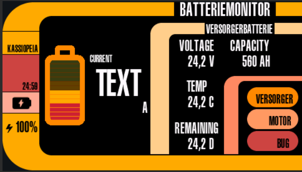

# Batteriemonitor mit Display und Signal K Integration

## Projektziel:
Das Ziel dieses Projekts ist die Entwicklung eines ESP32-basierten Batteriemonitor-Displays zur Überwachung der Batteriesysteme auf einem Boot. Das System ist in das Signal K Netzwerk integriert und visualisiert Echtzeit-Daten zu Spannung, Strom, Temperatur und verbleibender Batterielaufzeit.

## Was ist Signal K?
[Signal K](https://signalk.org/) ist ein offenes Datenformat für die maritime Elektronik. Es ermöglicht die Integration und den Austausch von Sensordaten zwischen verschiedenen Geräten und Anwendungen an Bord eines Boots.

## Was ist SenseESP?
[SenseESP](https://github.com/SignalK/SensESP) ist ein Open-Source-Framework, das die einfache Entwicklung von Sensoren ermöglicht, die ihre Daten über WLAN an einen Signal K-Server senden. Es basiert auf dem ESP32 und nutzt eine modulare Architektur für flexible Anpassungen.

## Hauptfunktionen:

- **Live-Anzeige der Batteriewerte**: Darstellung der Spannung, Stromstärke, Temperatur und verbleibenden Laufzeit für bis zu vier Batterien.
- **Signal K Integration**: Automatische Anpassung der abgerufenen Daten basierend auf den Signal K Pfaden.
- **Touchscreen-Steuerung**: Interaktive Anzeige mit LVGL zur intuitiven Bedienung.
- **Dynamische Konfiguration**: Namen der Batterien können über die SensESP WebUI festgelegt werden.
- **Display-Timeout mit Touch-Wake-Funktion**: Um Energie zu sparen, wird das Display nach einer Inaktivitätszeit ausgeschaltet und kann durch Berührung wieder aktiviert werden.
- **LCARS-Design**: Die Benutzeroberfläche ist im Stil des Star Trek LCARS Interfaces gestaltet.

## Hardware-Anforderungen:

- [**Guition JC4827W543 4,3" ESP32 Module**](https://de.aliexpress.com/item/1005006729377800.html)
- **Signal K Server** zur Bereitstellung der Daten
- **WiFi** zur Verbindung mit dem Signal K Netzwerk

## Software-Architektur:

- **Arduino GFX Library** für die Displaysteuerung
- **LVGL (LittlevGL)** zur Gestaltung der Benutzeroberfläche
- **SensESP** zur Kommunikation mit dem Signal K Server
- **Signal K Listener** zur Echtzeitüberwachung der Batteriesensorwerte

## Funktionsweise:

1. Beim Start werden die Namen der Batterien aus der Konfiguration geladen.
2. Die zugehörigen Signal K Pfade werden dynamisch erstellt.
3. Sensorwerte werden regelmäßig aus dem Netzwerk abgerufen und am Display aktualisiert.
4. Das Display zeigt visuell an, ob die Batterien laden oder entladen werden.
5. Eine Touch-Wake-Funktion sorgt für eine energiesparende Displaysteuerung.

## SensESP konfigurieren:
Nach dem ersten Start öffnet der ESP32 einen Access Point. 
Verbinden Sie sich mit dem Netzwerk und geben Sie die WLAN-Zugangsdaten ein (WLAN Passwort: thisisfine). 
Über die Web-UI von SensESP können Sie die Batterie konfigurieren (siehe Konfiguration) und den ESP32 in das Netzwerk einbinden, in dem der Signal K Server läuft.

## Lizenz:
Dieses Projekt steht unter der [GNU General Public License (GPL)](license.md).
